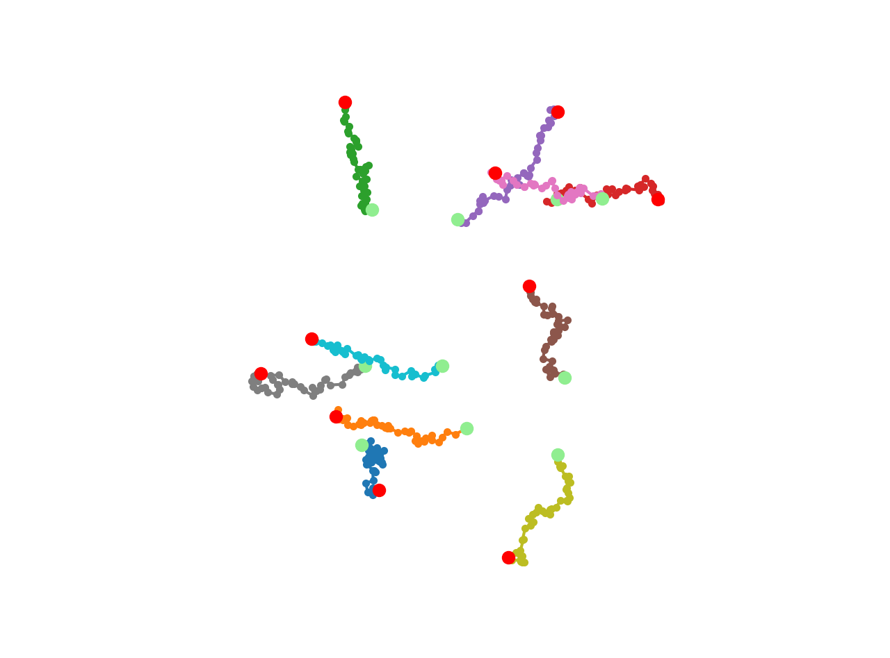

# TrackPal: Tracking Python AnaLyzer

A modular library for the analysis of object trackings in Python with pandas.

## Overview
### Main features
* Read Imaris / TrackMate files
* Simulate tracks with different motion types
* Compute track feature descriptors (~50 available features)
* Mean squared displacement curves for single tracks and ensembles
* Velocity autocorrelation curves for single tracks and ensembles
* Visualization utilities

For most computations TrackPal relies on pandas `groupby` and `apply` mechanism.

TrackPal does not track or link objects. It analyzes already tracked objects.
For obtaining object trackings from images or detections see for instance the
excellent projects [TrackMate](https://imagej.net/TrackMate),
[trackpy](http://soft-matter.github.io/trackpy) or [ilastik](ilastik.org)


## Examples

#### Simple simulation and plotting

```python
import trackpal as tp

trj = tp.simulate.brownian_linear(n_tracks=10)

trj.groupby("TrackID").apply(
    tp.visu.plot_trj, coords=["Position X", "Position Y"], line_fmt=".-",
)
```

Output:



#### Track features

* Simulate different motion types and compute track feautures
    * [Features](examples/01_track_features.ipynb)

#### Mean squared displacement curves

* Calculate diffusion constant and velocity from different simulated motion types
    * [MSD](examples/02_mean_square_displacement_curves.ipynb)

## Installation

Anaconda Python (>=3.6) and a new environment are recommended

0. Install Anaconda Python (>=3.6)

```shell
conda create --name trackpal_env --python=3.7
conda activate trackpal_env
```

## Dependencies

* numpy
* pandas
* scikit_image
* scikit_learn
* tifffile
* tqdm
* scipy
* statsmodels
* matplotlib
* rdp
* tqdm

#### From PyPi:

1. `pip install TrackPal`

#### For development

1. `git clone` this repository
2. `cd trackpal`
3. `pip install -e .`


## Documentation

* [GitHub mirror](https://github.com/sommerc/trackpal)
* [GitLab IST](https://git.ist.ac.at/csommer/trackpal)
* [API documentation](https://trackpal.github.io/trackpal)

